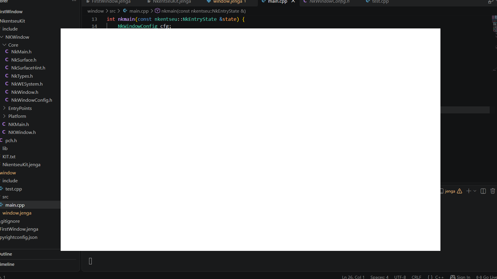

# DEMONSTRATION 3 
Dans cette démonstration, je dois montrer ma fenêtre sans bordure en fonctionnement : déplacement, agrandissement, boutons et dire ensuite ce que j'ai perdu par rapport à la barre du système.

Je commence d'abord par créer ma fenetre ensuite j'enlève les bords en faisant :
```
window.SetDecorated(false);
```
Je compile et le resultat est :
```
 jenga build

╔══════════════════════════════════════════════════════════════════╗
║                                                                  ║
║                ██╗███████╗███╗   ██╗ ██████╗  █████╗             ║
║                ██║██╔════╝████╗  ██║██╔════╝ ██╔══██╗            ║
║                ██║█████╗  ██╔██╗ ██║██║  ███╗███████║            ║
║           ██   ██║██╔══╝  ██║╚██╗██║██║   ██║██╔══██║            ║
║           ╚█████╔╝███████╗██║ ╚████║╚██████╔╝██║  ██║            ║
║            ╚════╝ ╚══════╝╚═╝  ╚═══╝ ╚═════╝ ╚═╝  ╚═╝            ║
║                                                                  ║
║             Multi-platform C/C++ Build System v2.8.0             ║
║                                                                  ║
╚══════════════════════════════════════════════════════════════════╝

Loading workspace...

Configuration: Debug
Target:        Windows x86_64
Toolchain:     clang-mingw

Build Order (1 projects):
  1. window [WINDOWED_APP]


╔══════════════════════════════════════════════════════════════════════════════════════════════╗
║  Project: window                                                         Kind: WINDOWED_APP  ║
╚══════════════════════════════════════════════════════════════════════════════════════════════╝

ℹ Found 1 source file(s)
✓   [1/1] Compiled: main.cpp
ℹ Linking...
✓ Built: Build\Bin\Debug-Windows\window\window.exe

┌──────────────────────────────────────────────────────────────────────────────────────────────┐
│  ✓ Build Successful                                                             Time: 3.62s  │
└──────────────────────────────────────────────────────────────────────────────────────────────┘

════════════════════════════════════════════════════════════════════════════════
                                BUILD COMPLETED                                 
════════════════════════════════════════════════════════════════════════════════
Projects Built:  1/1
Status:         ✓ SUCCESS
════════════════════════════════════════════════════════════════════════════════
```

je lance l'exécution :

```
PS C:\Users\NOELA\Desktop\jen\FirstWindow> jenga run

╔══════════════════════════════════════════════════════════════════╗
║                                                                  ║
║                ██╗███████╗███╗   ██╗ ██████╗  █████╗             ║
║                ██║██╔════╝████╗  ██║██╔════╝ ██╔══██╗            ║
║                ██║█████╗  ██╔██╗ ██║██║  ███╗███████║            ║
║           ██   ██║██╔══╝  ██║╚██╗██║██║   ██║██╔══██║            ║
║           ╚█████╔╝███████╗██║ ╚████║╚██████╔╝██║  ██║            ║
║                                                                  ║
║             Multi-platform C/C++ Build System v2.8.0             ║
║                                                                  ║
╚══════════════════════════════════════════════════════════════════╝


━━━━━━━━━━━━━━━━━━━━━━━━━━━━━━━━━━━━━━━━━━━━━━━━━━━━━━━━━━━━━━━━━━━━━━━━━━━━━━━━
  ▶  EXECUTION  —  window.exe
     C:\Users\NOELA\Desktop\jen\FirstWindow\Build\Bin\Debug-Windows\window\window.exe
━━━━━━━━━━━━━━━━━━━━━━━━━━━━━━━━━━━━━━━━━━━━━━━━━━━━━━━━━━━━━━━━━━━━━━━━━━━━━━━━

[2026-09-28 03:00:17.722] [INF] [default] [main.cpp:69 in nkmain] -> Reduire la fenetre
[2026-09-28 03:00:26.821] [INF] [default] [main.cpp:94 in nkmain] -> Deplacer la fenetre
[2026-09-28 03:00:33.715] [INF] [default] [main.cpp:80 in nkmain] -> Maximiser la fenetre

━━━━━━━━━━━━━━━━━━━━━━━━━━━━━━━━━━━━━━━━━━━━━━━━━━━━━━━━━━━━━━━━━━━━━━━━━━━━━━━━
  ◀  FIN D'EXECUTION  —  termine normalement  (26.41s)
━━━━━━━━━━━━━━━━━━━━━━━━━━━━━━━━━━━━━━━━━━━━━━━━━━━━━━━━━━━━━━━━━━━━━━━━━━━━━━━━
```
J'ai mis les **logger** pour pouvoir afficher dans le terminal les différents actions ou évèments que j'ai éffectué

On peut voir la fenetre sans bordures



une fois cette étape éffectuée, la barre de titre et les boutons ne sont plus visibles donc on ne peut plus fermer, redimensionner, agrandir, réduire la fenetre, la fenêtre perd toutes ses fonctionnalités d'interaction de base
## Je décris ce que j'ai perdu 
En désactivant le cadre natif (window.SetDecorated(false)), je confie l'ensemble de la gestion de l'interface au code de mon application par conséquent je perds plusieurs fonctionnalités automatique géres par le système d'exploitation (Winodows, macOS ou Linux) parmis lesquelles :
- Menus d'ancrage window 11 : survoler le bouton d'agrandissement ne fait plus apparaitre la grille d'agrandissement et glisser la fenetre vers le bord supérieur de l'écran pour la maximiser ne fonctionne plus automatiquement
- Les racourcis claviers du système sont perudes
- les 4 bords de la fenetre ainsi que les 4 coins ne réafissent plus au passage de la souris
- Les animations de transition: les effets fluides de réduction vers la barre de taches, d'agrandissement ou de fermeture de la fenetre
- Les bordures contextuel système : le menu qui s'affiche via un clic droit sur la barre de titre ou en combinant les touches(Alt-Espace) offrant les options(restaurer, déplacer, taille, réduire, agrandir, fermer)
- Les ombres protées et matériaux visuels de l'OS: l'ombre portée qui détache la fenetre du fond d'écran, ainsi que les effets de transparence ou de flou intégrés au système comme Mica ou Acrylic sur Windows