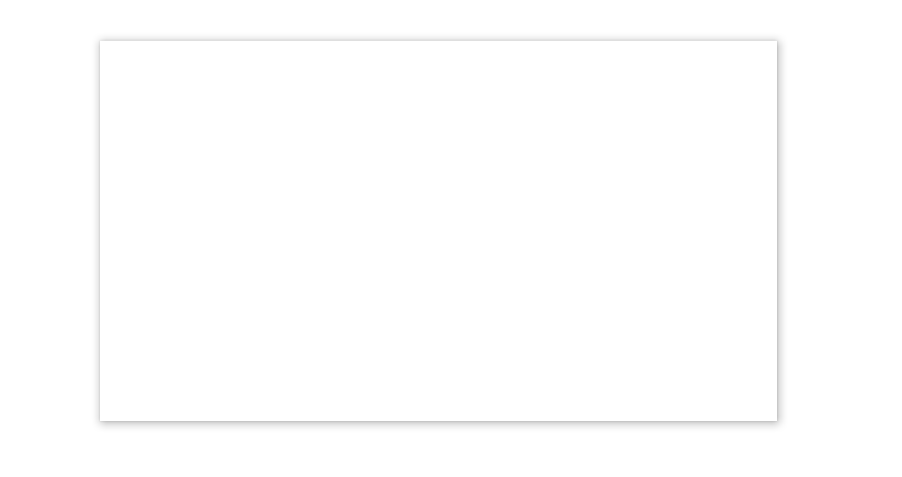
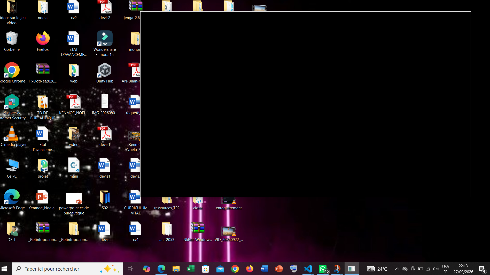

# DEMONSTRATION 3 
Dans cette démonstration, je dois montrer ma fenêtre sans bordure en fonctionnement : déplacement, agrandissement, boutons et dire ensuite ce que j'ai perdu par rapport à la barre du système.

Je commence d'abord par créer ma fenetre ensuite j'enlève les bords en faisant :
```
cfg.frame = false;
```
Je compile et le resultat est :
```
 jenga build

╔══════════════════════════════════════════════════════════════════╗
║                                                                  ║
║                ██╗███████╗███╗   ██╗ ██████╗  █████╗             ║
║                ██║██╔════╝████╗  ██║██╔════╝ ██╔══██╗            ║
║                ██║█████╗  ██╔██╗ ██║██║  ███╗███████║            ║
║           ██   ██║██╔══╝  ██║╚██╗██║██║   ██║██╔══██║            ║
║           ╚█████╔╝███████╗██║ ╚████║╚██████╔╝██║  ██║            ║
║            ╚════╝ ╚══════╝╚═╝  ╚═══╝ ╚═════╝ ╚═╝  ╚═╝            ║
║                                                                  ║
║             Multi-platform C/C++ Build System v2.8.0             ║
║                                                                  ║
╚══════════════════════════════════════════════════════════════════╝

Loading workspace...

Configuration: Debug
Target:        Windows x86_64
Toolchain:     clang-mingw

Build Order (1 projects):
  1. window [WINDOWED_APP]


╔══════════════════════════════════════════════════════════════════════════════════════════════╗
║  Project: window                                                         Kind: WINDOWED_APP  ║
╚══════════════════════════════════════════════════════════════════════════════════════════════╝

ℹ Found 1 source file(s)
✓   [1/1] Compiled: main.cpp
ℹ Linking...
✓ Built: Build\Bin\Debug-Windows\window\window.exe

┌──────────────────────────────────────────────────────────────────────────────────────────────┐
│  ✓ Build Successful                                                             Time: 3.62s  │
└──────────────────────────────────────────────────────────────────────────────────────────────┘

════════════════════════════════════════════════════════════════════════════════
                                BUILD COMPLETED                                 
════════════════════════════════════════════════════════════════════════════════
Projects Built:  1/1
Status:         ✓ SUCCESS
════════════════════════════════════════════════════════════════════════════════
```

je lance l'exécution :

```
(venv) PS C:\Users\NOELA\Desktop\jen\FirstWindow> jenga run  

╔══════════════════════════════════════════════════════════════════╗
║                                                                  ║
║                ██╗███████╗███╗   ██╗ ██████╗  █████╗             ║
║                ██║██╔════╝████╗  ██║██╔════╝ ██╔══██╗            ║
║                ██║█████╗  ██╔██╗ ██║██║  ███╗███████║            ║
║           ██   ██║██╔══╝  ██║╚██╗██║██║   ██║██╔══██║            ║
║           ╚█████╔╝███████╗██║ ╚████║╚██████╔╝██║  ██║            ║
║            ╚════╝ ╚══════╝╚═╝  ╚═══╝ ╚═════╝ ╚═╝  ╚═╝            ║
║                                                                  ║
║             Multi-platform C/C++ Build System v2.8.0             ║
║                                                                  ║
╚══════════════════════════════════════════════════════════════════╝


━━━━━━━━━━━━━━━━━━━━━━━━━━━━━━━━━━━━━━━━━━━━━━━━━━━━━━━━━━━━━━━━━━━━━━━━━━━━━━━━
  ▶  EXECUTION  —  window.exe
     C:\Users\NOELA\Desktop\jen\FirstWindow\Build\Bin\Debug-Windows\window\window.exe
━━━━━━━━━━━━━━━━━━━━━━━━━━━━━━━━━━━━━━━━━━━━━━━━━━━━━━━━━━━━━━━━━━━━━━━━━━━━━━━━


━━━━━━━━━━━━━━━━━━━━━━━━━━━━━━━━━━━━━━━━━━━━━━━━━━━━━━━━━━━━━━━━━━━━━━━━━━━━━━━━
  ◀  FIN D'EXECUTION  —  termine normalement  (6.75s)
━━━━━━━━━━━━━━━━━━━━━━━━━━━━━━━━━━━━━━━━━━━━━━━━━━━━━━━━━━━━━━━━━━━━━━━━━━━━━━━━
```
On peut voir la fenetre sans bordures



une fois cette étape éffectuée, la barre de titre et les boutons ne sont plus visibles donc on ne peut plus fermer, redimensionner, agrandir, réduire la fenetre. Je vais donc crée mes propres boutons pour éffectuer ces taches. Pour cela je vais utiliser les fonctios tels que :
```

```
Le code qui permet d'éffectuer ces modifications sans **frame** est :
```
#include "NKWindow/NKMain.h"
#include "NKWindow/NKWindow.h"
#include "NKEvent/NkEventSystem.h"
#include "NKEvent/NkWindowEvent.h"
#include "NKEvent/NkMouseEvent.h"
#include <string>

NKENTSEU_DEFINE_APP_DATA(([]() { return nkentseu::NkAppData{}; })());

using namespace nkentseu;

int nkmain(const nkentseu::NkEntryState &state) {
    NkWindowConfig cfg;
    cfg.title = "Rotation Camera (Sans Capture)";
    cfg.width = 1280;
    cfg.height = 720;
    cfg.frame = false;
   
    NkWindow window(cfg);
   
    bool running = true;
    while (running && window.IsOpen()) {
        while (NkEvent* ev = NkEvents().PollEvent()) {

            // Fermeture via signal OS (ex: Alt+F4)
            if (ev->Is<NkWindowCloseEvent>()) {
                window.Close();
                running = false;
            }

            if (auto* press = ev->As<NkMouseButtonPressEvent>()) {
                if (press->IsLeft()) {
                    float x = press->GetX();
                    float y = press->GetY();
                    float winWidth = static_cast<float>(window.GetSize().x);


                    if (y >= 0 && y <= 40) {
                        // BOUTON RÉDUIRE (zone relative au bord droit)
                        if (x >= winWidth - 150 && x < winWidth - 100) {
                            window.Minimize();
                            ev->MarkHandled();
                        }
                        // BOUTON MAXIMISER / RESTAURER
                        else if (x >= winWidth - 100 && x < winWidth - 50) {
                            if (window.IsMaximized()) {
                                window.Restore();
                            } else {
                                window.Maximize();
                            }
                            ev->MarkHandled();
                        }
                        // BOUTON FERMER
                        else if (x >= winWidth - 50 && x <= winWidth) {
                            window.Close(); // Ferme réellement la fenêtre
                            running = false;
                            ev->MarkHandled();
                        }
                        // BARRE DE TITRE (Déplacement)
                        else {
                            window.BeginDragMove();
                            ev->MarkHandled();
                        }
                    }
                }
            }

          
            if (auto* dbl = ev->As<NkMouseDoubleClickEvent>()) {
                if (dbl->IsLeft()) {
                    float x = dbl->GetX();
                    float y = dbl->GetY();
                
                    float winWidth = static_cast<float>(window.GetSize().x);

                    if (y >= 0 && y <= 40 && x < winWidth - 150) {
                        if (window.IsMaximized()) {
                            window.Restore();
                        } else {
                            window.Maximize();
                        }
                        ev->MarkHandled();
                    }
                }
            }

            if (auto* release = ev->As<NkMouseButtonReleaseEvent>()) {
                if (release->IsLeft()) {
                    ev->MarkHandled();
                }
            }
        }
    }
    return 0;
}
```
Je compile
```
jenga build                                                               

╔══════════════════════════════════════════════════════════════════╗
║                                                                  ║
║                ██╗███████╗███╗   ██╗ ██████╗  █████╗             ║
║                ██║██╔════╝████╗  ██║██╔════╝ ██╔══██╗            ║
║                ██║█████╗  ██╔██╗ ██║██║  ███╗███████║            ║
║           ██   ██║██╔══╝  ██║╚██╗██║██║   ██║██╔══██║            ║
║           ╚█████╔╝███████╗██║ ╚████║╚██████╔╝██║  ██║            ║
║            ╚════╝ ╚══════╝╚═╝  ╚═══╝ ╚═════╝ ╚═╝  ╚═╝            ║
║                                                                  ║
║             Multi-platform C/C++ Build System v2.8.0             ║
║                                                                  ║
╚══════════════════════════════════════════════════════════════════╝

Loading workspace...

Configuration: Debug
Target:        Windows x86_64
Toolchain:     clang-mingw

Build Order (1 projects):
  1. window [WINDOWED_APP]


╔══════════════════════════════════════════════════════════════════════════════════════════════╗
║  Project: window                                                         Kind: WINDOWED_APP  ║
╚══════════════════════════════════════════════════════════════════════════════════════════════╝

ℹ Found 1 source file(s)
✓   [1/1] Compiled: main.cpp
ℹ Linking...
✓ Built: Build\Bin\Debug-Windows\window\window.exe

┌──────────────────────────────────────────────────────────────────────────────────────────────┐
│  ✓ Build Successful                                                             Time: 4.52s  │
└──────────────────────────────────────────────────────────────────────────────────────────────┘
════════════════════════════════════════════════════════════════════════════════
                                BUILD COMPLETED                                 
════════════════════════════════════════════════════════════════════════════════
Projects Built:  1/1
Time:           4.52s
Status:         ✓ SUCCESS
════════════════════════════════════════════════════════════════════════════════
```
Puis j'execute
```
jenga run

╔══════════════════════════════════════════════════════════════════╗
║                                                                  ║
║                ██╗███████╗███╗   ██╗ ██████╗  █████╗             ║
║                ██║██╔════╝████╗  ██║██╔════╝ ██╔══██╗            ║
║                ██║█████╗  ██╔██╗ ██║██║  ███╗███████║            ║
║           ██   ██║██╔══╝  ██║╚██╗██║██║   ██║██╔══██║            ║
║           ╚█████╔╝███████╗██║ ╚████║╚██████╔╝██║  ██║            ║
║            ╚════╝ ╚══════╝╚═╝  ╚═══╝ ╚═════╝ ╚═╝  ╚═╝            ║
║                                                                  ║
║             Multi-platform C/C++ Build System v2.8.0             ║
║                                                                  ║
╚══════════════════════════════════════════════════════════════════╝


━━━━━━━━━━━━━━━━━━━━━━━━━━━━━━━━━━━━━━━━━━━━━━━━━━━━━━━━━━━━━━━━━━━━━━━━━━━━━━━━
  ▶  EXECUTION  —  window.exe
     C:\Users\NOELA\Desktop\jen\FirstWindow\Build\Bin\Debug-Windows\window\window.exe
━━━━━━━━━━━━━━━━━━━━━━━━━━━━━━━━━━━━━━━━━━━━━━━━━━━━━━━━━━━━━━━━━━━━━━━━━━━━━━━━


━━━━━━━━━━━━━━━━━━━━━━━━━━━━━━━━━━━━━━━━━━━━━━━━━━━━━━━━━━━━━━━━━━━━━━━━━━━━━━━━
  ◀  FIN D'EXECUTION  —  termine normalement  (62.29s)
━━━━━━━━━━━━━━━━━━━━━━━━━━━━━━━━━━━━━━━━━━━━━━━━━━━━━━━━━━━━━━━━━━━━━━━━━━━━━━━━
```
- J'essai d'agrandir la fenetre :


- Je bouge la fenetre 



- Je peux réduire la fenetre


## 
En désactivant le cadre natif (cfg.frame = false), je confie l'ensemble de la gestion de l'interface au code de mon application par conséquent je perds plusieurs fonctionnalités automatique géres par le système d'exploitation (Winodows, macOS ou Linux) parmis lesquelles :
- Les animations de transition: les effets fluides de réduction vers la barre de taches, d'agrandissement ou de fermeture de la fenetre
- Les bordures contextuel système : le menu qui s'affiche via un clic droit sur la barre de titre ou en combinant les touches(Alt-Espace) offrant les options(restaurer, déplacer, taille, réduire, agrandir, fermer)
- Les ombres protées et matériaux visuels de l'OS: l'ombre portée qui détache la fenetre du fond d'écran, ainsi que les effets de transparence ou de flou intégrés au système comme Mica ou Acrylic sur Windows