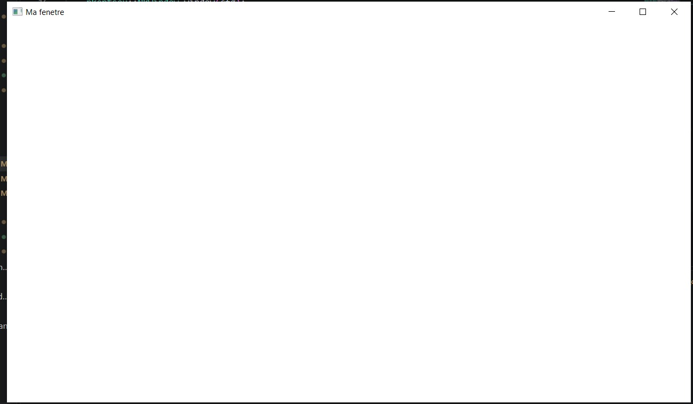

# EXERCICE 1

cette exercice consite a crée une fentre nue avec un code minimal
Une fois le code écrit je compile avec la commande  :
```
jenga build
```
Le resultat de la commande est :
```
PS C:\Users\NOELA\Desktop\ani-2053\chapitre-03\exo1-la_fenetre_nue> jenga build

╔══════════════════════════════════════════════════════════════════╗
║                                                                  ║
║                ██╗███████╗███╗   ██╗ ██████╗  █████╗             ║
║                ██║██╔════╝████╗  ██║██╔════╝ ██╔══██╗            ║
║                ██║█████╗  ██╔██╗ ██║██║  ███╗███████║            ║
║           ██   ██║██╔══╝  ██║╚██╗██║██║   ██║██╔══██║            ║
║           ╚█████╔╝███████╗██║ ╚████║╚██████╔╝██║  ██║            ║
║            ╚════╝ ╚══════╝╚═╝  ╚═══╝ ╚═════╝ ╚═╝  ╚═╝            ║
║                                                                  ║
║             Multi-platform C/C++ Build System v2.8.0             ║
║                                                                  ║
╚══════════════════════════════════════════════════════════════════╝

Loading workspace...

Configuration: Debug
Target:        Windows x86_64
Toolchain:     clang-mingw

Build Order (1 projects):
  1. exercice 1 [WINDOWED_APP]


╔══════════════════════════════════════════════════════════════════════════════════════════════╗
║  Project: exercice 1                                                     Kind: WINDOWED_APP  ║

ℹ Found 1 source file(s)
✓   [1/1] Compiled: c3-exo1_main.cpp
ℹ Linking...
✓ Built: Build\Bin\Debug-Windows\exercice 1\exercice 1.exe

┌──────────────────────────────────────────────────────────────────────────────────────────────┐
│  ✓ Build Successful                                                             Time: 3.90s  │
└──────────────────────────────────────────────────────────────────────────────────────────────┘

════════════════════════════════════════════════════════════════════════════════
                                BUILD COMPLETED                                 
════════════════════════════════════════════════════════════════════════════════
Projects Built:  1/1
Time:           3.90s
Status:         ✓ SUCCESS
════════════════════════════════════════════════════════════════════════════════

```
Ensuite je lance l'exécution avec la commande :
```
jenga run
```
Le resultat est :
```
(venv) PS C:\Users\NOELA\Desktop\ani-2053\chapitre-03\exo1-la_fenetre_nue> jenga run

╔══════════════════════════════════════════════════════════════════╗
║                                                                  ║
║                ██╗███████╗███╗   ██╗ ██████╗  █████╗             ║
║                ██║██╔════╝████╗  ██║██╔════╝ ██╔══██╗            ║
║                ██║█████╗  ██╔██╗ ██║██║  ███╗███████║            ║
║           ██   ██║██╔══╝  ██║╚██╗██║██║   ██║██╔══██║            ║
║           ╚█████╔╝███████╗██║ ╚████║╚██████╔╝██║  ██║            ║
║            ╚════╝ ╚══════╝╚═╝  ╚═══╝ ╚═════╝ ╚═╝  ╚═╝            ║
║                                                                  ║
║             Multi-platform C/C++ Build System v2.8.0             ║
║                                                                  ║
╚══════════════════════════════════════════════════════════════════╝


━━━━━━━━━━━━━━━━━━━━━━━━━━━━━━━━━━━━━━━━━━━━━━━━━━━━━━━━━━━━━━━━━━━━━━━━━━━━━━━━
  ▶  EXECUTION  —  exercice 1.exe
     C:\Users\NOELA\Desktop\ani-2053\chapitre-03\exo1-la_fenetre_nue\Build\Bin\Debug-Windows\exercice 1\exercice 1.exe
━━━━━━━━━━━━━━━━━━━━━━━━━━━━━━━━━━━━━━━━━━━━━━━━━━━━━━━━━━━━━━━━━━━━━━━━━━━━━━━━


━━━━━━━━━━━━━━━━━━━━━━━━━━━━━━━━━━━━━━━━━━━━━━━━━━━━━━━━━━━━━━━━━━━━━━━━━━━━━━━━
  ◀  FIN D'EXECUTION  —  termine normalement  (3.84s)
━━━━━━━━━━━━━━━━━━━━━━━━━━━━━━━━━━━━━━━━━━━━━━━━━━━━━━━━━━━━━━━━━━━━━━━━━━━━━━━━
```
L'affichage de la fenetre nue

## Explication du code ligne par ligne 

Mon code a **18 lignes** au total
## Les lignes similaires a celles du chapitre sont :
Le programme minimal du chapitre est le suivant : 
```
#include "NKWindow/NKWindow.h"
#include "NKWindow/NKMain.h"

using namespace nkentseu;

// Métadonnées de l'app — lues par le runtime AVANT nkmain().
// On passe une expression qui retourne un NkAppData (ici une lambda appelée).
NKENTSEU_DEFINE_APP_DATA(([]() {
    NkAppData d{};
    d.appName    = "MonJeu";
    d.appVersion = "0.1.0";
    return d;
})());

int nkmain(const NkEntryState& state) {
    // 1 Décrire la fenêtre
    NkWindowConfig cfg;
    cfg.title  = "Hello NKWindow";
    cfg.width  = 1280;
    cfg.height = 720;

    // 2 Créer la fenêtre
    NkWindow window;
    if (!window.Create(cfg)) {
        return -1;   // échec de création
    }

    // 3 Boucle principale (voir §3)
    while (window.IsOpen()) {
        while (NkEvent* ev = NkEvents().PollEvent()) {
            // traiter les entrées — détaillé dans le guide NKEvent
        }
        // mettre à jour la logique, puis dessiner (NKCanvas)
    }

    return 0;
}
```
|TABLEAU DE CORRESPONDANCE|        |       |
|-------------------------|--------|-------|
|lignes de mon code|Lignes du code du chapitre|Explications|
| L1 (#include "NKWindow/NKMain.h")| L1 (#include "NKWindow/NKWindow.h")|Identiques|
|L2 (#include "NKWindow/NKWindow.h")|L2 (#include "NKWindow/NKMain.h")|Identiques. Inclusion du module fenêtre|
|OMIS|L4 (using namespace nkentseu;)|éviter d'importer tout l'espace de nommage dans la portée globale|
|OMIS|L8 à 13 (NKENTSEU_DEFINE_APP_DATA(([]() {.....)|Supprimer car les métadonnées par défaut du runtime sont utilisées automatiquement, pour avoir le strict minimum.|
|L4 (int nkmain(...))|L16 (int nkmain(...))|Les memes. Point d'entrée de l'application|
|OMIS|L18 à 21 (NkWindowConfig cfg;...)|Supprimer Utilisation de la configuration par défaut du constructeur de NkWindow.|
|OMIS|L24 (NkWindow window;)|Le constructeur par défaut initialise et crée directement la fenêtre à .Create(cfg).|
|OMIS| L25 à 27 (if (!window.Create(cfg)) {...)|Évite la double création de fenêtre car l'état d'ouverture est géré par window.IsOpen()|
|L9 (while (window.IsOpen()) {)|L30 (while (window.IsOpen()) {)|Condition de la boucle principale|
|L10 (while (NkEvent* ev = NkEvents().PollEvent()) {)|L31 (while (NkEvent* ev = NkEvents().PollEvent()) {)|trdjdfct|
|L11 à L13 (if (event->Is<nkentseu::NkWindowCloseEvent>())...)|OMIS|traitement de la fermeture de fenêtre avec window.Close()|
|L14 à 15 ({})| L34 à 36|Fermeture de la boucle d'évènement|
|L17 (return 0;)|L38 (return 0;)|Fin normale du programme|


