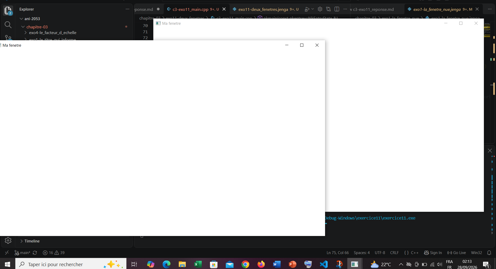

# EXERCICE 3
Pour cet exercice je vais créer deux fenetres et voir comment elle se comportent lorsque je fais un clic
Une fois le code écrit, je compile :
```
PS C:\Users\NOELA\Desktop\ani-2053\chapitre-03\exo11-deux_fenetres> jenga b

╔══════════════════════════════════════════════════════════════════╗
║                                                                  ║
║                ██╗███████╗███╗   ██╗ ██████╗  █████╗             ║
║                ██║██╔════╝████╗  ██║██╔════╝ ██╔══██╗            ║
║                ██║█████╗  ██╔██╗ ██║██║  ███╗███████║            ║
║           ██   ██║██╔══╝  ██║╚██╗██║██║   ██║██╔══██║            ║
║           ╚█████╔╝███████╗██║ ╚████║╚██████╔╝██║  ██║            ║
║            ╚════╝ ╚══════╝╚═╝  ╚═══╝ ╚═════╝ ╚═╝  ╚═╝            ║
║                                                                  ║
║             Multi-platform C/C++ Build System v2.8.0             ║
║                                                                  ║
╚══════════════════════════════════════════════════════════════════╝

Loading workspace...

Configuration: Debug
Target:        Windows x86_64
Toolchain:     clang-mingw

Build Order (1 projects):
  1. exercice11 [WINDOWED_APP]


╔═════════════════════════════════════════════════════════════════════════════════
║  Project: exercice11                                                     Kind: W
╚═════════════════════════════════════════════════════════════════════════════════

ℹ Found 1 source file(s)
✓   [1/1] Compiled: c3-exo11_main.cpp
ℹ Linking...
✓ Built: Build\Bin\Debug-Windows\exercice11\exercice11.exe
┌─────────────────────────────────────────────────────────────────────────────────
│  ✓ Build Successful                                                             
└─────────────────────────────────────────────────────────────────────────────────

════════════════════════════════════════════════════════════════════════════════
                                BUILD COMPLETED                                 
════════════════════════════════════════════════════════════════════════════════
Projects Built:  1/1
Time:           5.20s
Status:         ✓ SUCCESS
════════════════════════════════════════════════════════════════════════════════

```
Ensuite j'exécute
```
 PS C:\Users\NOELA\Desktop\ani-2053\chapitre-03\exo11-deux_fenetres> jenga r

╔══════════════════════════════════════════════════════════════════╗
║                                                                  ║
║                ██╗███████╗███╗   ██╗ ██████╗  █████╗             ║
║                ██║██╔════╝████╗  ██║██╔════╝ ██╔══██╗            ║
║                ██║█████╗  ██╔██╗ ██║██║  ███╗███████║            ║
║           ██   ██║██╔══╝  ██║╚██╗██║██║   ██║██╔══██║            ║
║           ╚█████╔╝███████╗██║ ╚████║╚██████╔╝██║  ██║            ║
║            ╚════╝ ╚══════╝╚═╝  ╚═══╝ ╚═════╝ ╚═╝  ╚═╝            ║
║                                                                  ║
║             Multi-platform C/C++ Build System v2.8.0             ║
║                                                                  ║
╚══════════════════════════════════════════════════════════════════╝


━━━━━━━━━━━━━━━━━━━━━━━━━━━━━━━━━━━━━━━━━━━━━━━━━━━━━━━━━━━━━━━━━━━━━━━━━━━━━━━━
  ▶  EXECUTION  —  exercice11.exe
     C:\Users\NOELA\Desktop\ani-2053\chapitre-03\exo11-deux_fenetres\Build\Bin\Deb
━━━━━━━━━━━━━━━━━━━━━━━━━━━━━━━━━━━━━━━━━━━━━━━━━━━━━━━━━━━━━━━━━━━━━━━━━━━━━━━━

[2026-09-28 02:14:09.975] [INF] [default] [c3-exo11_main.cpp:64 in nkmain] -> ferm
[2026-09-28 02:14:11.843] [INF] [default] [c3-exo11_main.cpp:60 in nkmain] -> ferm

━━━━━━━━━━━━━━━━━━━━━━━━━━━━━━━━━━━━━━━━━━━━━━━━━━━━━━━━━━━━━━━━━━━━━━━━━━━━━━━━
  ◀  FIN D'EXECUTION  —  termine normalement  (31.51s)
━━━━━━━━━━━━━━━━━━━━━━━━━━━━━━━━━━━━━━━━━━━━━━━━━━━━━━━━━━━━━━━━━━━━━━━━━━━━━━━━
```
Nous voyons alors bien deux fenetres s'affichées 



1. Lorsque j'effectue un clic les systèmes d'exploitation (Windows, Linux, macOS) attribuent un identifinat natif unique (handle) a chaque fenetre crée et c'est la fenetre qui se trouve sous le curseur qui recoit le clic. Celle qui est derriere ne recoit pas le clic
2. Ce qui manquerait pour dessiner dans les deux est :
* un contexte graphique: chaque fenetre doit etre liée à une API de rendu (OpenGL, Vulkan, DirectX)
* un gestionnaire de pipelin de rendu : pour définir la zone d'affichage adapté à la taille de chaque fenetre, effacer l'ecran (clear) et éxecuter les comandes d'affichage spécifiques à chacune
* Le changement de contexte courant (Context Switching) : Avec les API cités plus haut, un seul contexte peut etre à la fois sur un **theard**. Avant de dessiner dans la premi_re fenetre  il faut activer son contexte, dessiner , puis activer le contexte de la seconde fenetre pour y dessiner à son tour