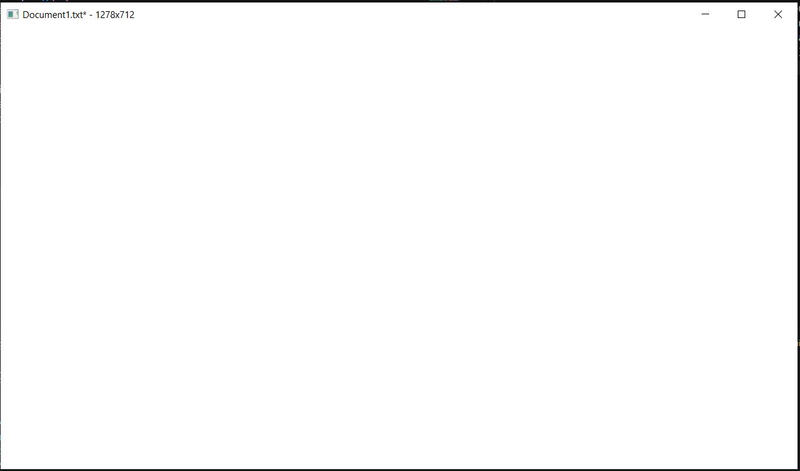
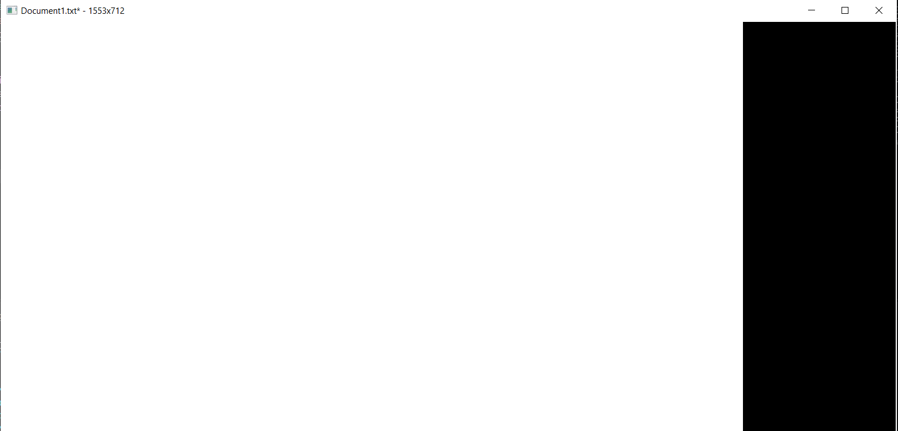
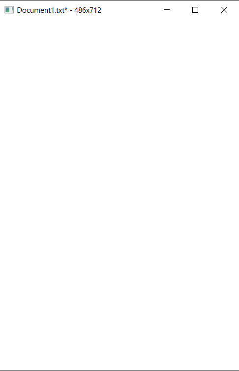
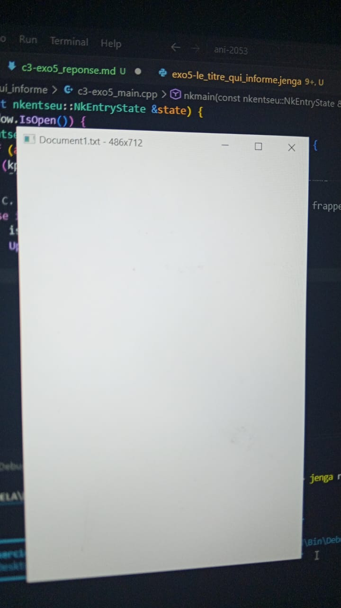

# EXERCICE 5
Dans cet exercice il est question d'affichez dans le titre l'état de mon programme : le nom du document, un astérisque s'il est modifié, et la taille courante de la fenêtre, le Mettre à jour au bon moment, et non chaque image. 
Pour cela je commence par ecrire mon code :
- J'implémente ma fonction qui va se charge des modifications du titre
```
void UpdateWindowTitle(nkentseu::NkWindow& window, const nkentseu::NkString& docName, bool isModified) {
```
- Dans cette fonction, je récupère la taille de la fenetre vie l4API
```
nkentseu::math::NkVec2u size = window.GetSize();
```
- Je construis la chaine de titre 
```
std::string titleStr = docName.Data();
```
- je pose la condition pour l'affichage de l'astérisque si le fichier est modifié
```
if (isModified) {
        titleStr += "*";
    }
    
```
- J'ajoute la taille de la fenetre qui sera affichée a coté du titre 
```
titleStr += " - " + std::to_string(size.x) + "x" + std::to_string(size.y);
```
- Jéapplique maintenant le nouveau itre via l'API toujours
```
window.SetTitle(titleStr.c_str()); 
```
- J'ajoute désormais ma fonction nkmain dans laquelle je vais appeler ma fonction définie plus haut 
- J'appelle la fonction pour la mise a jour initiale du titre 
```
UpdateWindowTitle(window, docName, isModified);
```
- Dans la bouvle des évènements, je fais la gestion des touches du clavier avec :
```
else if (auto* kp = ev->As<NkKeyPressEvent>()) {
```
- Pour l'enregistrement :
```
if (kp->GetKey() == NkKey::NK_S && kp->HasCtrl()) {
                isModified = false;
                UpdateWindowTitle(window, docName, isModified);
                ev->MarkHandled(); // Marquer l'événement comme consommé
            }
```
- Pour modifier le fichier sur n'importe quelle frappe 
```
else if (!isModified) {
                isModified = true;
                UpdateWindowTitle(window, docName, isModified);
            }
```
Une fois tout cela terminé je peut maintenant compilé le tout 
```
PS C:\Users\NOELA\Desktop\ani-2053\chapitre-03\exo5-le_titre_qui_informe> jenga build 

╔══════════════════════════════════════════════════════════════════╗
║                                                                  ║
║                ██╗███████╗███╗   ██╗ ██████╗  █████╗             ║
║                ██║██╔════╝████╗  ██║██╔════╝ ██╔══██╗            ║
║                ██║█████╗  ██╔██╗ ██║██║  ███╗███████║            ║
║           ██   ██║██╔══╝  ██║╚██╗██║██║   ██║██╔══██║            ║
║           ╚█████╔╝███████╗██║ ╚████║╚██████╔╝██║  ██║            ║
║            ╚════╝ ╚══════╝╚═╝  ╚═══╝ ╚═════╝ ╚═╝  ╚═╝            ║
║                                                                  ║
║             Multi-platform C/C++ Build System v2.8.0             ║
║                                                                  ║
╚══════════════════════════════════════════════════════════════════╝

Loading workspace...

Configuration: Debug
Target:        Windows x86_64
Toolchain:     clang-mingw

Build Order (1 projects):
  1. exercice 5 [WINDOWED_APP]


╔══════════════════════════════════════════════════════════════════════════════════════════════╗
║  Project: exercice 5                                                     Kind: WINDOWED_APP  ║
╚══════════════════════════════════════════════════════════════════════════════════════════════╝

ℹ Found 1 source file(s)
✓   [1/1] Compiled: c3-exo5_main.cpp
ℹ Linking...
✓ Built: Build\Bin\Debug-Windows\exercice 5\exercice 5.exe

┌──────────────────────────────────────────────────────────────────────────────────────────────┐
│  ✓ Build Successful                                                             Time: 9.52s  │
└──────────────────────────────────────────────────────────────────────────────────────────────┘

════════════════════════════════════════════════════════════════════════════════
                                BUILD COMPLETED                                 
════════════════════════════════════════════════════════════════════════════════
Projects Built:  1/1
Time:           9.57s
Status:         ✓ SUCCESS
════════════════════════════════════════════════════════════════════════════════
```
Je lance ensuite l'exécution 
```
jenga run

╔══════════════════════════════════════════════════════════════════╗
║                                                                  ║
║                ██╗███████╗███╗   ██╗ ██████╗  █████╗             ║
║                ██║██╔════╝████╗  ██║██╔════╝ ██╔══██╗            ║
║                ██║█████╗  ██╔██╗ ██║██║  ███╗███████║            ║
║           ██   ██║██╔══╝  ██║╚██╗██║██║   ██║██╔══██║            ║
║           ╚█████╔╝███████╗██║ ╚████║╚██████╔╝██║  ██║            ║
║            ╚════╝ ╚══════╝╚═╝  ╚═══╝ ╚═════╝ ╚═╝  ╚═╝            ║
║                                                                  ║
║             Multi-platform C/C++ Build System v2.8.0             ║
║                                                                  ║
╚══════════════════════════════════════════════════════════════════╝


━━━━━━━━━━━━━━━━━━━━━━━━━━━━━━━━━━━━━━━━━━━━━━━━━━━━━━━━━━━━━━━━━━━━━━━━━━━━━━━━
  ▶  EXECUTION  —  exercice 5.exe
     C:\Users\NOELA\Desktop\ani-2053\chapitre-03\exo5-le_titre_qui_informe\Build\Bin\Debug-Windows\exercice 5\exercice 5.exe
━━━━━━━━━━━━━━━━━━━━━━━━━━━━━━━━━━━━━━━━━━━━━━━━━━━━━━━━━━━━━━━━━━━━━━━━━━━━━━━━


━━━━━━━━━━━━━━━━━━━━━━━━━━━━━━━━━━━━━━━━━━━━━━━━━━━━━━━━━━━━━━━━━━━━━━━━━━━━━━━━
  ◀  FIN D'EXECUTION  —  termine normalement  (505.34s)
━━━━━━━━━━━━━━━━━━━━━━━━━━━━━━━━━━━━━━━━━━━━━━━━━━━━━━━━━━━━━━━━━━━━━━━━━━━━━━━━
```
J'éffectue la première modification en appuyant sur n'importe quelle touche du clavier. On obtient le résultat : 

- En étirant ou en réduisant la fentre a la souris on obtient :


- Sauvegarde du document avec **Ctrl+S**, le résultat est :

