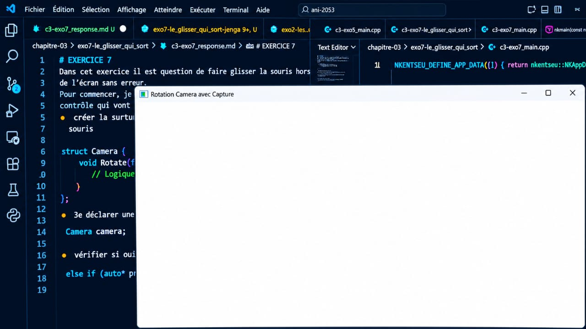
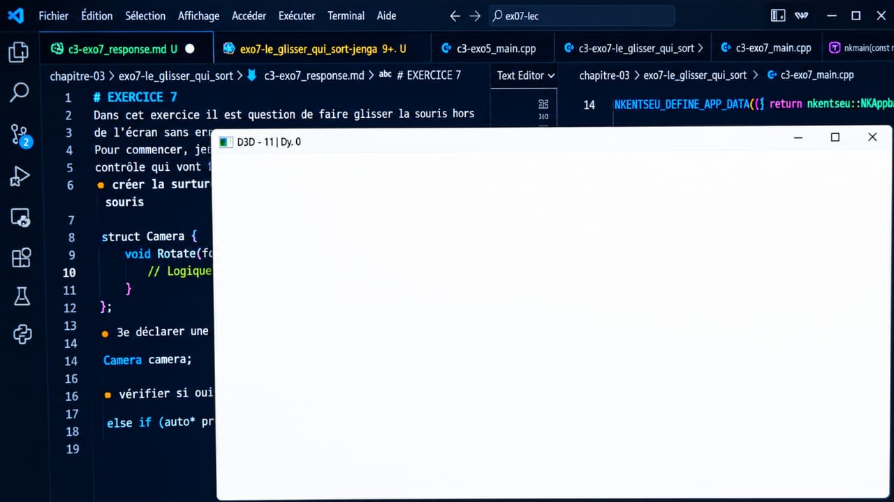
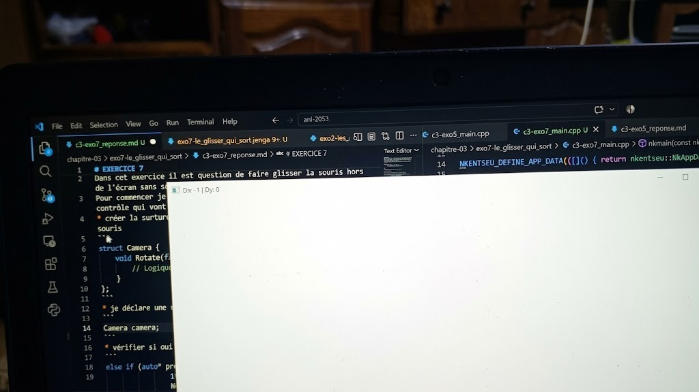
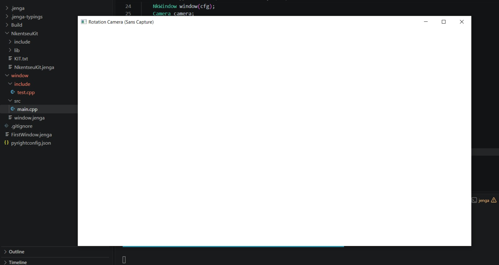
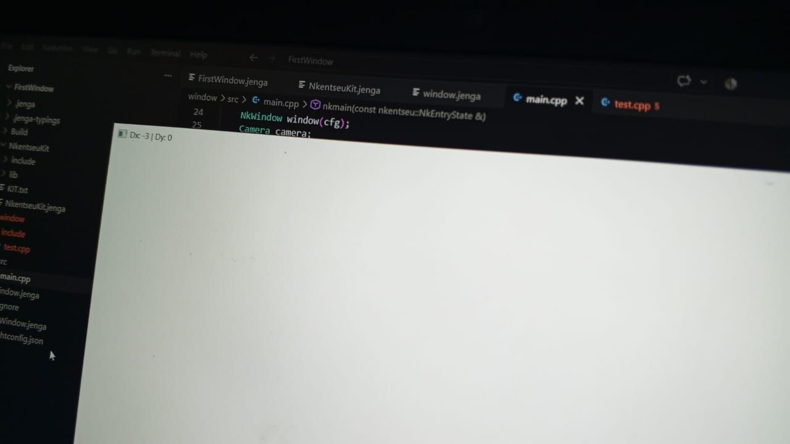
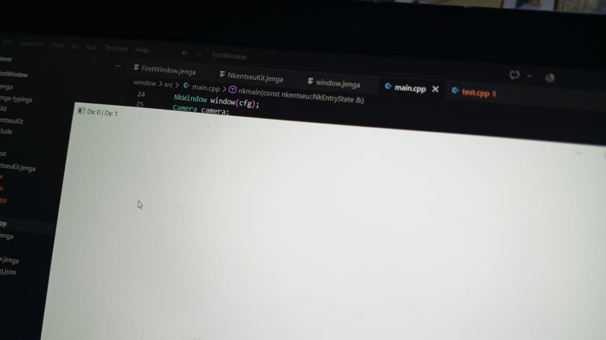
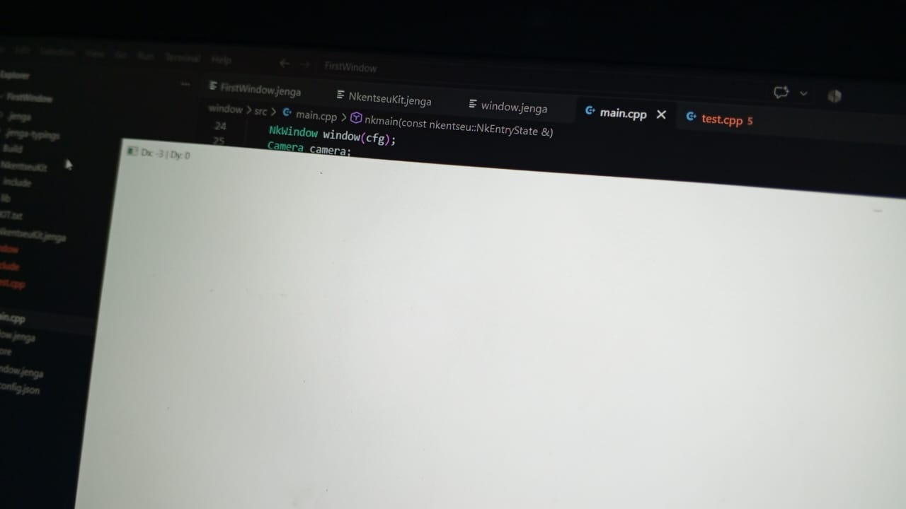

# EXERCICE 7
Dans cet exercice il est question de faire glisser la souris hors de l'écran sans et avec capture et comparer les deux ensuite 
Pour commencer je crée ma fentre puis j'ajoute les sturcture de controle qui vont me permettre de
* créer la surture Camera qui va suivrent les mouuvement de la souris
```
struct Camera {
    void Rotate(float dx, float dy) {
        // Logique de rotation de la caméra
    }
};
```
* je déclare une variable de type Caméra :
```
Camera camera;
```
* vérifier si oui ou non le clic droit est enfoncé
```
else if (auto* press = ev->As<NkMouseButtonPressEvent>()) {
                if (press->GetButton() == NkMouseButton::NK_MB_RIGHT) {
                    window.CaptureMouse(true);
                }
            }
```
* S'il est relaché :
```
else if (auto* release = ev->As<NkMouseButtonReleaseEvent>()) {
                if (release->GetButton() == NkMouseButton::NK_MB_RIGHT) {
                    window.CaptureMouse(false);
                    window.SetTitle("Rotation Camera avec Capture"); 
                }
            }
```
* Le déplacement de la souris avec la caméra :
```
else if (auto* move = ev->As<NkMouseMoveEvent>()) {
                if (move->IsButtonDown(NkMouseButton::NK_MB_RIGHT)) {
                    int32 dx = move->GetDeltaX();
                    int32 dy = move->GetDeltaY();

                    // Action 1 : Modifier la caméra
                    camera.Rotate(static_cast<float>(dx), static_cast<float>(dy));

                    // Action 2 : Afficher les variations dans le titre
                    std::string t = "Dx: " + std::to_string(dx) + " | Dy: " + std::to_string(dy);
                    window.SetTitle(t.c_str());
                }
            }
```
* Afficher les variatons : 
```
// Action 2 : Afficher les variations dans le titre
                    std::string t = "Dx: " + std::to_string(dx) + " | Dy: " + std::to_string(dy);
                    window.SetTitle(t.c_str());
```
Cette partie affiche les varaitions de la souris grace a la camera pour voir si elle sort de la fentre ou si elle est encore dans la denetre au niveau du titre 
Pour suivre la souris nous avons utilisés les fonctions suivantes contenues dans NkWindow
```
// --- Souris ---
			void SetMousePosition(uint32 x, uint32 y);

			void SetMousePosition(const math::NkVec2u &pos) {
				SetMousePosition(pos.x, pos.y);
			}

			void ShowMouse(bool show);
			void CaptureMouse(bool capture);
```
* Je lance ensuite la compilation :
```
S C:\Users\NOELA\Desktop\ani-2053\chapitre-03\exo7-le_glisser_qui_sort> jenga build

╔══════════════════════════════════════════════════════════════════╗
║                                                                  ║
║                ██╗███████╗███╗   ██╗ ██████╗  █████╗             ║
║                ██║██╔════╝████╗  ██║██╔════╝ ██╔══██╗            ║
║                ██║█████╗  ██╔██╗ ██║██║  ███╗███████║            ║
║           ██   ██║██╔══╝  ██║╚██╗██║██║   ██║██╔══██║            ║
║           ╚█████╔╝███████╗██║ ╚████║╚██████╔╝██║  ██║            ║
║            ╚════╝ ╚══════╝╚═╝  ╚═══╝ ╚═════╝ ╚═╝  ╚═╝            ║
║                                                                  ║
║             Multi-platform C/C++ Build System v2.8.0             ║
║                                                                  ║
╚══════════════════════════════════════════════════════════════════╝

Loading workspace...

Configuration: Debug
Target:        Windows x86_64
Toolchain:     clang-mingw

Build Order (1 projects):
  1. exercice7 [WINDOWED_APP]


╔══════════════════════════════════════════════════════════════════════════════════════════════╗
║  Project: exercice7                                                      Kind: WINDOWED_APP  ║
╚══════════════════════════════════════════════════════════════════════════════════════════════╝

ℹ Found 1 source file(s)
✓   [1/1] Compiled: c3-exo7_main.cpp
ℹ Linking...
✓ Built: Build\Bin\Debug-Windows\exercice7\exercice7.exe

┌──────────────────────────────────────────────────────────────────────────────────────────────┐
│  ✓ Build Successful                                                             Time: 4.15s  │
└──────────────────────────────────────────────────────────────────────────────────────────────┘

════════════════════════════════════════════════════════════════════════════════
                                BUILD COMPLETED                                 
════════════════════════════════════════════════════════════════════════════════
Projects Built:  1/1
Time:           4.15s
Status:         ✓ SUCCESS
════════════════════════════════════════════════════════════════════════════════

```
je lance l'exécution du programme
```
(venv) PS C:\Users\NOELA\Desktop\ani-2053\chapitre-03\exo7-le_glisser_qui_sort> jenga run

╔══════════════════════════════════════════════════════════════════╗
║                                                                  ║
║                ██╗███████╗███╗   ██╗ ██████╗  █████╗             ║
║                ██║██╔════╝████╗  ██║██╔════╝ ██╔══██╗            ║
║                ██║█████╗  ██╔██╗ ██║██║  ███╗███████║            ║
║           ██   ██║██╔══╝  ██║╚██╗██║██║   ██║██╔══██║            ║
║           ╚█████╔╝███████╗██║ ╚████║╚██████╔╝██║  ██║            ║
║            ╚════╝ ╚══════╝╚═╝  ╚═══╝ ╚═════╝ ╚═╝  ╚═╝            ║
║                                                                  ║
║             Multi-platform C/C++ Build System v2.8.0             ║
║                                                                  ║
╚══════════════════════════════════════════════════════════════════╝

━━━━━━━━━━━━━━━━━━━━━━━━━━━━━━━━━━━━━━━━━━━━━━━━━━━━━━━━━━━━━━━━━━━━━━━━━━━
  ▶  EXECUTION  —  exercice7.exe
     C:\Users\NOELA\Desktop\ani-2053\chapitre-03\exo7-le_glisser_qui_sort\B

━━━━━━━━━━━━━━━━━━━━━━━━━━━━━━━━━━━━━━━━━━━━━━━━━━━━━━━━━━━━━━━━━━━━━━━━━━━
  ◀  FIN D'EXECUTION  —  termine normalement  (39.18s)
━━━━━━━━━━━━━━━━━━━━━━━━━━━━━━━━━━━━━━━━━━━━━━━━━━━━━━━━━━━━━━━━━━━━━━━━━━━
```
Le résultat est le suivant :



On voit bien le titre rotation avec capture

Maintenant on teste la capture



Meme hors de la fenetre les coordonnées changent



## Pour le glisser sans capture
Cette partie est faite dans le dossier FirtsWindow.Le code est le suivant :
```
#include "NKWindow/NKMain.h"
#include "NKWindow/NKWindow.h"
#include "NKEvent/NkEventSystem.h"
#include "NKEvent/NkWindowEvent.h"
#include "NKEvent/NkMouseEvent.h"
#include <string>

struct Camera {
    void Rotate(float dx, float dy) {
        // Logique de rotation de la caméra
    }
};

NKENTSEU_DEFINE_APP_DATA(([]() { return nkentseu::NkAppData{}; })());

using namespace nkentseu;

int nkmain(const nkentseu::NkEntryState &state) {
    NkWindowConfig cfg;
    cfg.title = "Rotation Camera (Sans Capture)";
    cfg.width = 1280;
    cfg.height = 720;

    NkWindow window(cfg);
    Camera camera;

    while (window.IsOpen()) {
        while (NkEvent* ev = NkEvents().PollEvent()) {

            // 1. Fermeture de la fenêtre
            if (ev->Is<NkWindowCloseEvent>()) {
                window.Close();
            }

            // 2. Déplacement et rotation (quand le clic droit est maintenu)
            else if (auto* move = ev->As<NkMouseMoveEvent>()) {
                if (move->IsButtonDown(NkMouseButton::NK_MB_RIGHT)) {
                    int32 dx = move->GetDeltaX();
                    int32 dy = move->GetDeltaY();

                    camera.Rotate(static_cast<float>(dx), static_cast<float>(dy));

                    std::string t = "Dx: " + std::to_string(dx) + " | Dy: " + std::to_string(dy);
                    window.SetTitle(t.c_str());
                }
            }
        }
    }

    return 0;
}
```
Je compile  :
```
 PS C:\Users\NOELA\Desktop\jen\FirstWindow> jenga build 

╔══════════════════════════════════════════════════════════════════╗
║                                                                  ║
║                ██╗███████╗███╗   ██╗ ██████╗  █████╗             ║
║                ██║██╔════╝████╗  ██║██╔════╝ ██╔══██╗            ║
║                ██║█████╗  ██╔██╗ ██║██║  ███╗███████║            ║
║           ██   ██║██╔══╝  ██║╚██╗██║██║   ██║██╔══██║            ║
║           ╚█████╔╝███████╗██║ ╚████║╚██████╔╝██║  ██║            ║
║            ╚════╝ ╚══════╝╚═╝  ╚═══╝ ╚═════╝ ╚═╝  ╚═╝            ║
║                                                                  ║
║             Multi-platform C/C++ Build System v2.8.0             ║
║                                                                  ║
╚══════════════════════════════════════════════════════════════════╝

Loading workspace...

Configuration: Debug
Target:        Windows x86_64
Toolchain:     clang-mingw

Build Order (1 projects):
  1. window [WINDOWED_APP]


╔══════════════════════════════════════════════════════════════════════════════════════════════╗
║  Project: window                                                         Kind: WINDOWED_APP  ║
╚══════════════════════════════════════════════════════════════════════════════════════════════╝

ℹ Found 1 source file(s)
✓   [1/1] Compiled: main.cpp
ℹ Linking...
✓ Built: Build\Bin\Debug-Windows\window\window.exe

┌──────────────────────────────────────────────────────────────────────────────────────────────┐
│  ✓ Build Successful                                                             Time: 3.91s  │
└──────────────────────────────────────────────────────────────────────────────────────────────┘

════════════════════════════════════════════════════════════════════════════════
════════════════════════════════════════════════════════════════════════════════
Projects Built:  1/1
Time:           3.91s
Status:         ✓ SUCCESS
════════════════════════════════════════════════════════════════════════════════

```

J'éxécute 
```
PS C:\Users\NOELA\Desktop\jen\FirstWindow> jenga run

╔══════════════════════════════════════════════════════════════════╗
║                                                                  ║
║                ██╗███████╗███╗   ██╗ ██████╗  █████╗             ║
║                ██║██╔════╝████╗  ██║██╔════╝ ██╔══██╗            ║
║                ██║█████╗  ██╔██╗ ██║██║  ███╗███████║            ║
║           ██   ██║██╔══╝  ██║╚██╗██║██║   ██║██╔══██║            ║
║           ╚█████╔╝███████╗██║ ╚████║╚██████╔╝██║  ██║            ║
║            ╚════╝ ╚══════╝╚═╝  ╚═══╝ ╚═════╝ ╚═╝  ╚═╝            ║
║                                                                  ║
║             Multi-platform C/C++ Build System v2.8.0             ║
║                                                                  ║
╚══════════════════════════════════════════════════════════════════╝


━━━━━━━━━━━━━━━━━━━━━━━━━━━━━━━━━━━━━━━━━━━━━━━━━━━━━━━━━━━━━━━━━━━━━━━━━━━━━━━━
  ▶  EXECUTION  —  window.exe
     C:\Users\NOELA\Desktop\jen\FirstWindow\Build\Bin\Debug-Windows\window\window.exe
━━━━━━━━━━━━━━━━━━━━━━━━━━━━━━━━━━━━━━━━━━━━━━━━━━━━━━━━━━━━━━━━━━━━━━━━━━━━━━━━


━━━━━━━━━━━━━━━━━━━━━━━━━━━━━━━━━━━━━━━━━━━━━━━━━━━━━━━━━━━━━━━━━━━━━━━━━━━━━━━━
  ◀  FIN D'EXECUTION  —  termine normalement  (792.17s)
━━━━━━━━━━━━━━━━━━━━━━━━━━━━━━━━━━━━━━━━━━━━━━━━━━━━━━━━━━━━━━━━━━━━━━━━━━━━━━━━
```
Le resultat est :



Lorsque l'on sort de la fenetre les coordonnées ne change plus peu importe ou se trouve la souris 







## La différence entre un glissé qui commence dans la fentre et continue a l'exterieur, sans capture et avec capture
- **Sans la capture** : si l'utilisateur maintient le clic droit, sort de la fenetre et relache le bouton à l'extérieur, la fenetre ne détecte pas le relachement. Conséquence en réentrant dans la fenetre, le jeu pense que le clic droit est toujours enfoncé, ce qui crée un sentiment de dysfonctionnement
-  **Avec capture** : c'est le comportement utilisé dans les jeux (FPS, 3D) et les logiciels de modélisation 3D (Bkender, Unity, Unreal Engine). Tous les mouvements de la souris sont envoyés exclusivement à la fenetre meme si physiquement le curseur dépasse les limites de celle-ci. L'utilisateur peut faire tourner la caméra à 360 degré sans etre bloqué par les bords. Peu importe ou se trouve la souris au moment ou l'utilisateur relache le bouton droit, la fenetre recevra obligatoirement l'évènement. Il n'y a pas de pertubations extérieures, l'utilisateur ne risque pas de cliquer accidentellement sur le bureau ou sur une autre fenetre pendant qu'il controle sa caméra

## REMARQUE
la méthode Rotate de la structure Camera est vide pour cet exercice car la mise à jour du titre de la fenêtre secfait  avec Dx et Dy qui servent de témoin visuel pour valider la réception des événements.